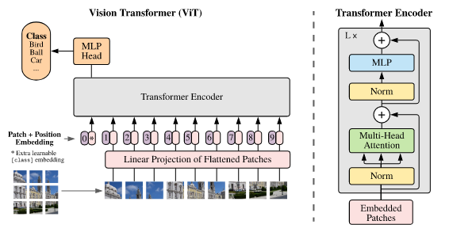

# Vision Transformers

Implementation of [Vision Transformer](https://openreview.net/forum?id=YicbFdNTTy) in PyTorch, a new model to achieve SOTA in vision classification with using transformer style encoders. Associated [blog](https://abhaygupta.dev/blog/vision-transformer) article.



## Features

- [x] Vanilla ViT
- [x] Hybrid ViT (with support for BiTResNets as backbone)
- [x] Hybrid ViT (with support for AxialResNets as backbone)
- [x] Training Scripts

To Do:

- [ ] Training Script
  - [ ] Support for linear decay
  - [ ] Correct hyper parameters
- [ ] Full Axial-ViT
- [ ] Results for Imagenet-1K and Imagenet-21K

## Installation

Create the environment:

```bash
conda env create -f environment.yml
```

Preparing the dataset:

```bash
mkdir data
cd data
ln -s path/to/dataset imagenet
```

## Running the Scripts

For *non-distributed training*:

```bash
python train.py --model ViT --name vit_logs
```

For *distributed training*:

```bash
CUDA_VISIBLE_DEVICES=0,1,2,3 python dist_train.py --model ViT --name vit_dist_logs
```

For *testing* add the `--test` parameter:

```bash
python train.py --model ViT --name vit_logs --test
CUDA_VISIBLE_DEVICES=0,1,2,3 python dist_train.py --model ViT --name vit_dist_logs --test
```

## References

1. BiTResNet: https://github.com/google-research/big_transfer/tree/master/bit_pytorch
2. AxialResNet: https://github.com/csrhddlam/axial-deeplab
3. Training Scripts: https://github.com/csrhddlam/axial-deeplab

## Citations

```BibTeX
@inproceedings{
    anonymous2021an,
    title={An Image is Worth 16x16 Words: Transformers for Image Recognition at Scale},
    author={Anonymous},
    booktitle={Submitted to International Conference on Learning Representations},
    year={2021},
    url={https://openreview.net/forum?id=YicbFdNTTy},
    note={under review}
}
```
